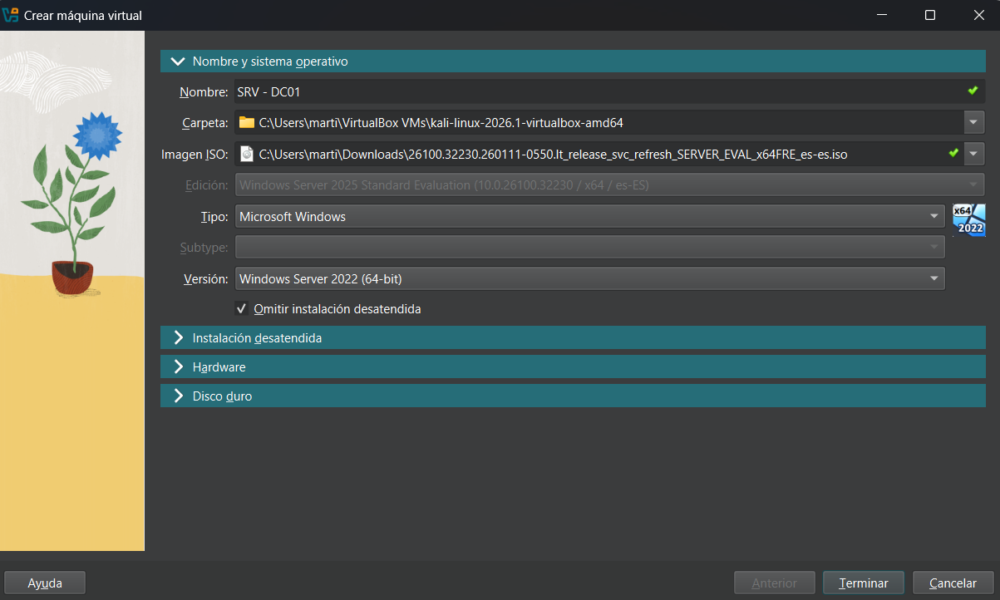
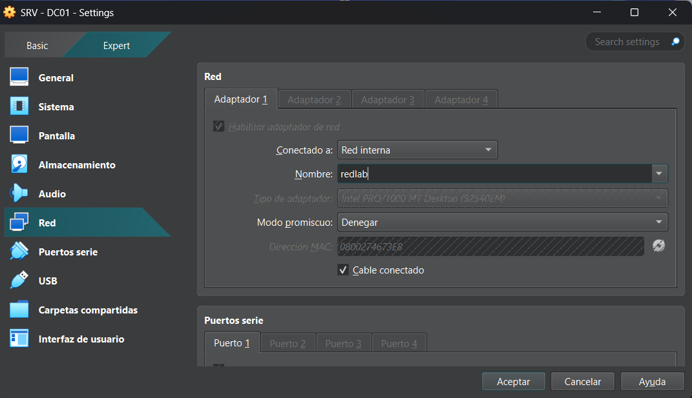
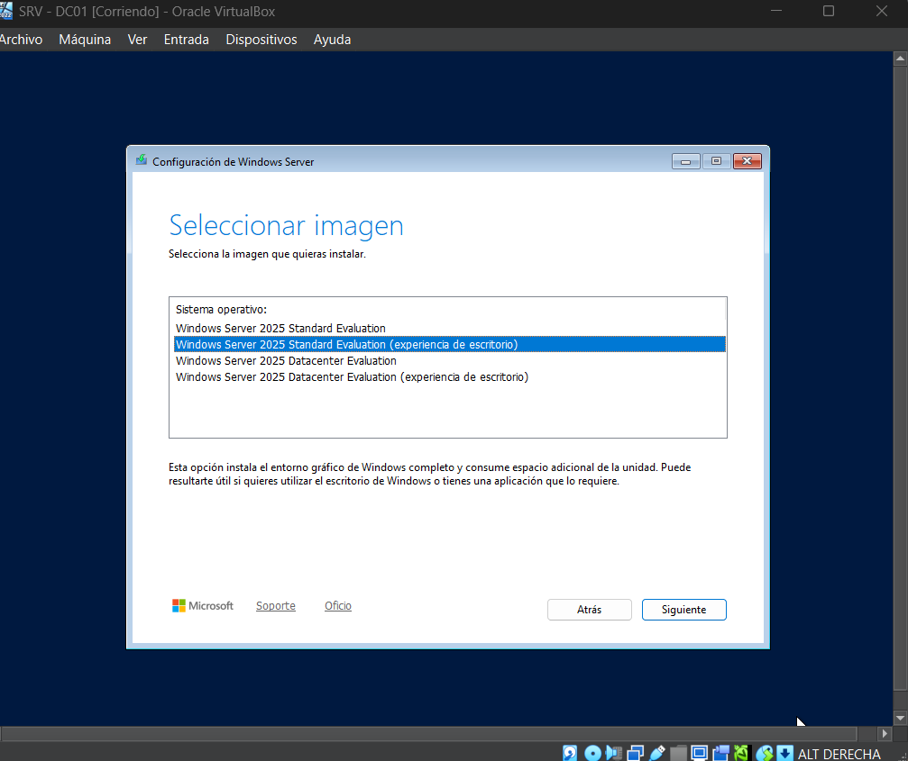
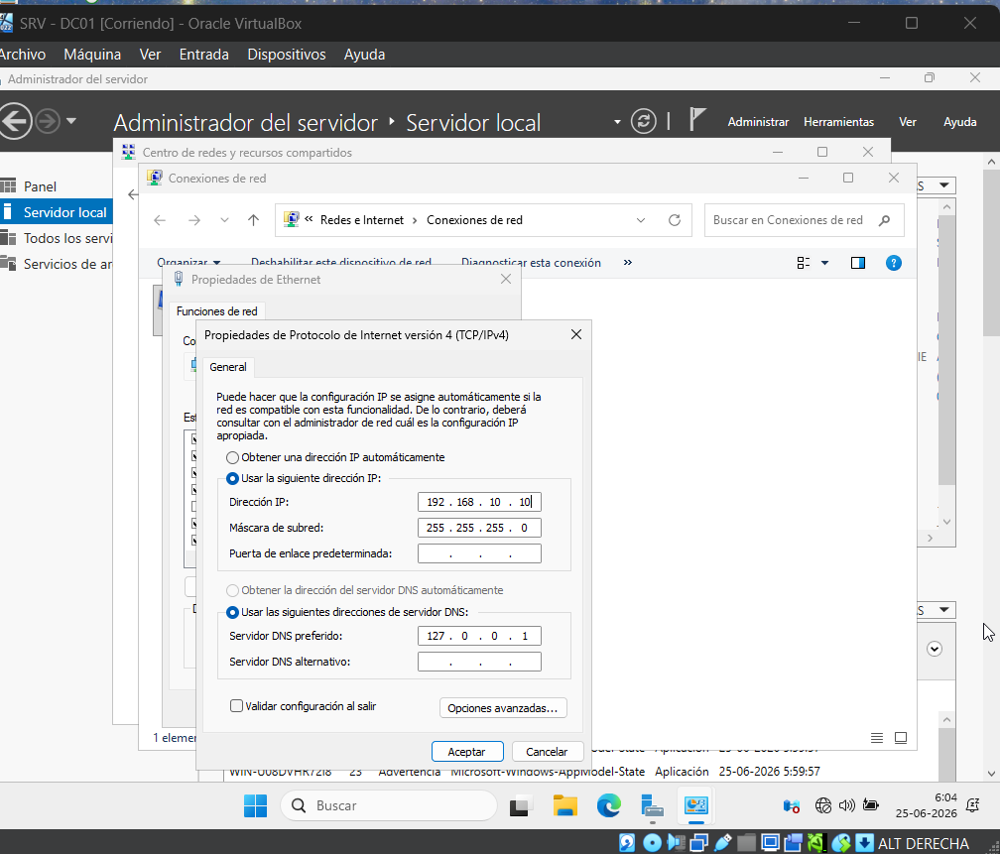
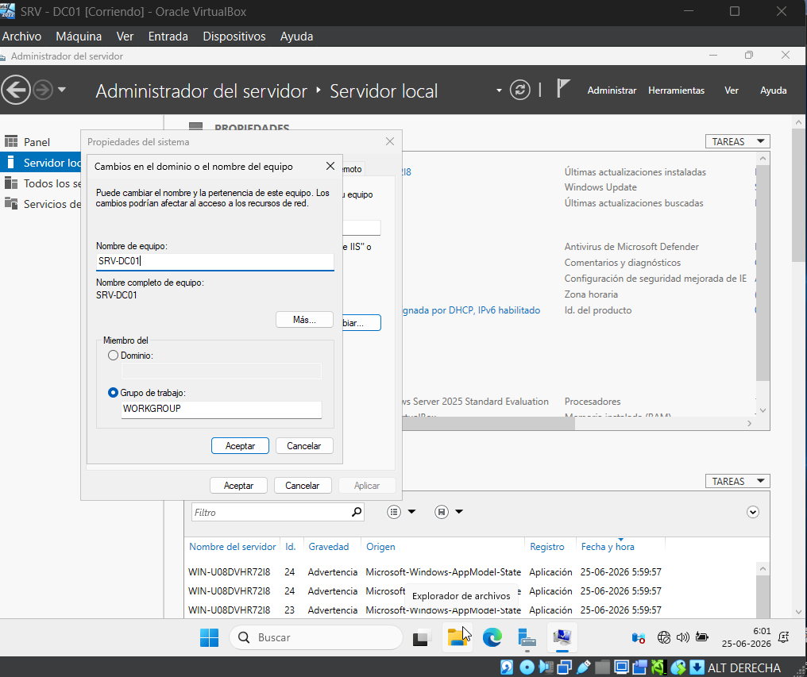

# 02.- Instalación y configuración (Criterio 2.1.1)

 En esta etapa, se preparó la máquina virtual que actuará como  el servidor principal.

 ## Servidor Windows Server (SRV-DC01), se siguieron estos pasos fundamentales: 
 
 Creación de la VM:

 Se configuró una máquina virtual en VirtualBox (versión Windows 2022/2025 de 64-bit, con 50 GB de almacenamiento dinámico)

 

Configuración de red:  Se conectó el adaptador de red a una "Red interna" bajo el nombre  “redlab” para asegurar la conectividad local.

 

Se instaló Windows Server 2025 Standard con Experiencia de escritorio. Identidad del equipo:
Se cambió el nombre del equipo a  “SRV-DC01”

 

Direccionamiento IP:
Se le asignó la IP estática "192.168.10.10" (con máscara de subred 255.255.255.0 y DNS apuntando a sí mismo: 127.0.0.1) para que pueda brindar servicios a la red. 

 

## Evidencia de la configuración 
Configuración inicial del servidor SRV-DC01

La imagen superior muestra el panel del "Administrador del servidor", donde se evidencia el cambio de nombre del equipo y la IP estática asignada correctamente.
