03.- Active Directory y DNS (Criterios 2.1.2  y  2.1.4)

Instalación de roles:
 
Agregar el rol "Servicios de dominio de Active Directory" (AD DS) mediante el Administrador del servidor.
 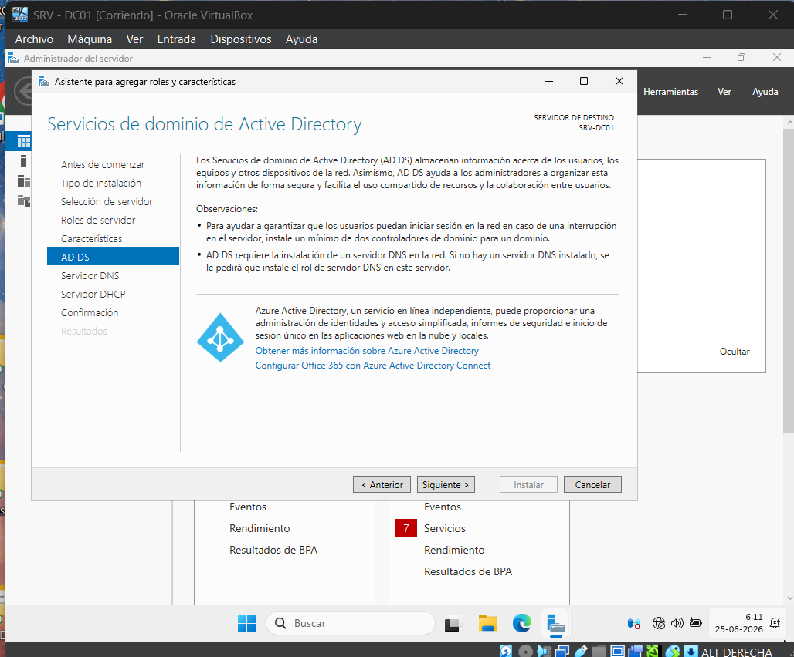

Configuración de equipo como controlador de dominio desde la bandera de notificación.
 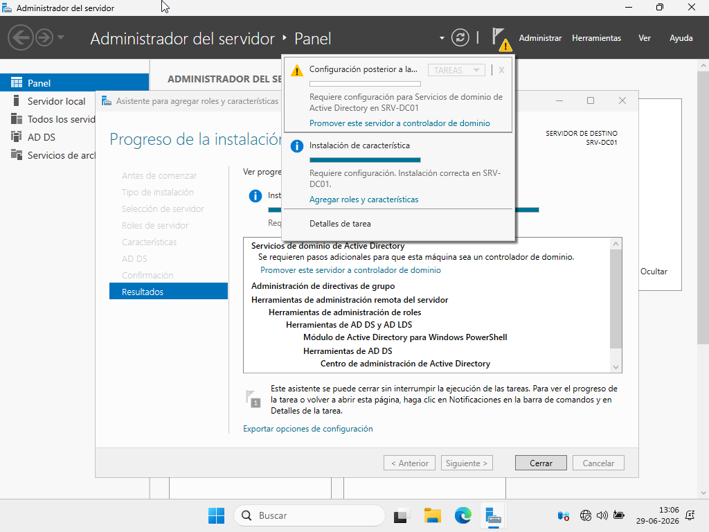

Configuración del bosque: Agregar un nuevo bosque utilizando "inacap.local" como dominio raíz.
 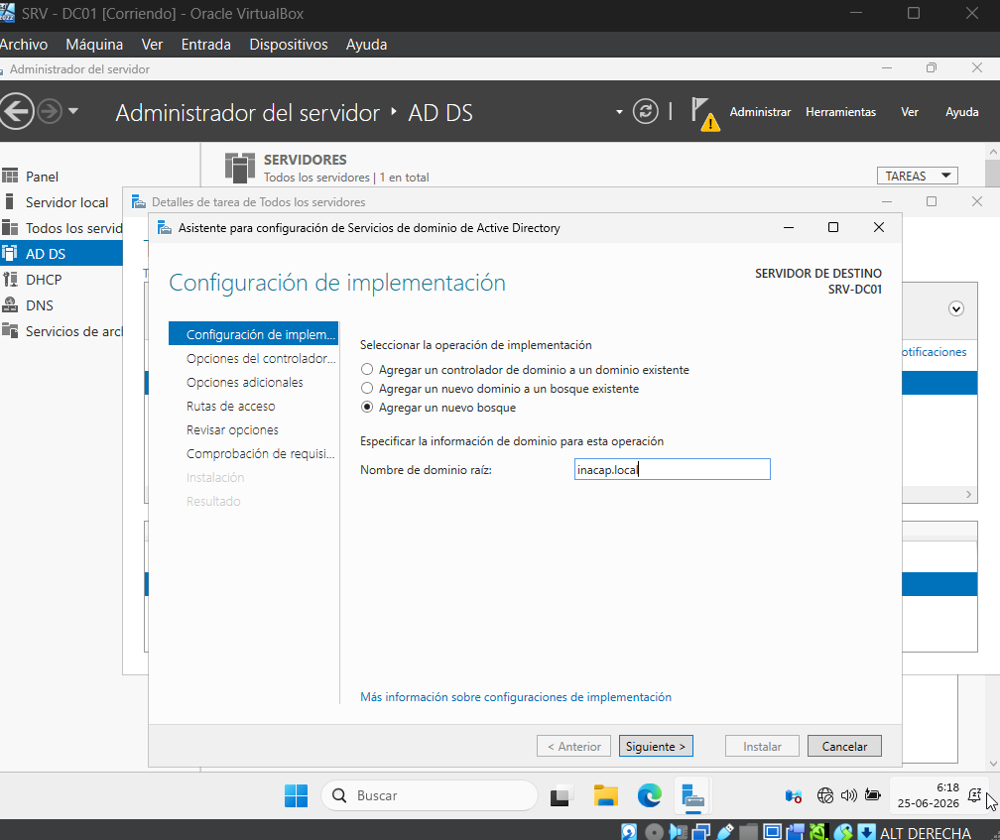

Inicio de sesión: Ingresar al sistema como INACAP\Administrator luego de que el equipo se reinicie.
 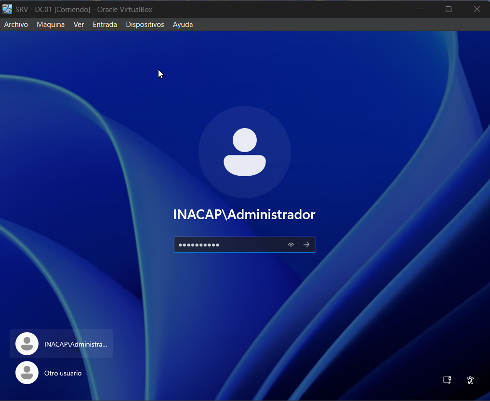

Gestión de objetos: Abrir la herramienta "Usuarios y equipos de Active Directory".
 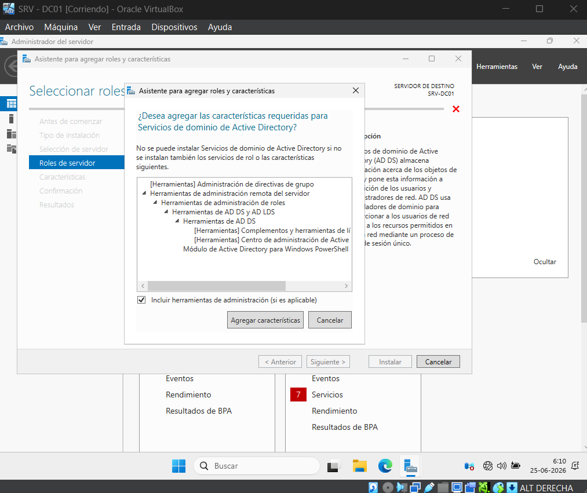  ### ME FALTA

Unidad Organizativa: Crear una nueva Unidad Organizativa con el nombre "Ventas".
 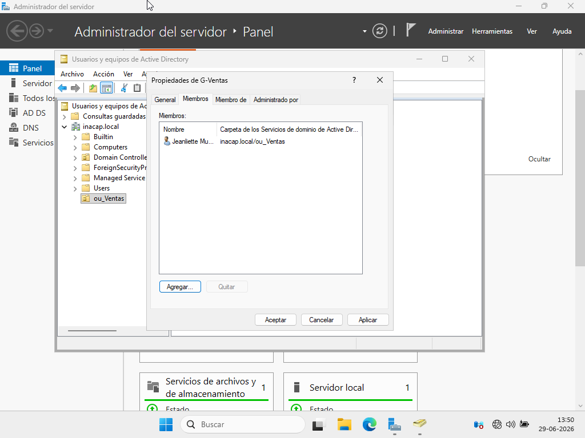

Creación de usuarios: Generar dos usuarios dentro de la OU Ventas.
 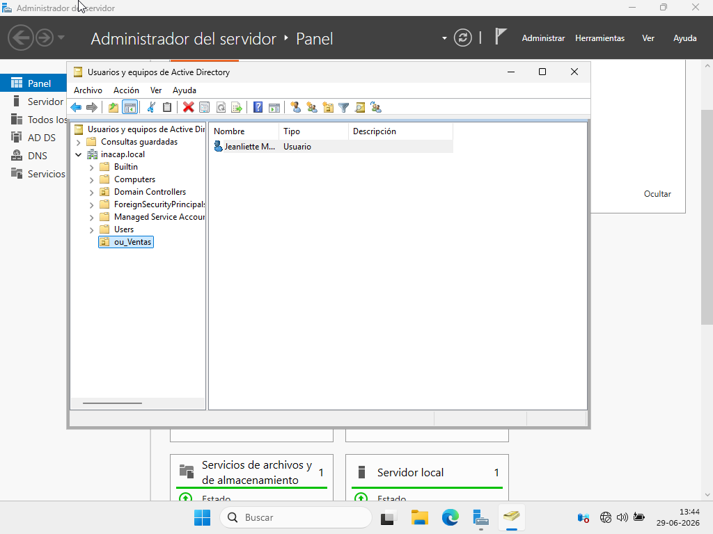 

Usuario principal: Utilizar tu código personal de alumno para el nombre de uno de estos usuarios.
 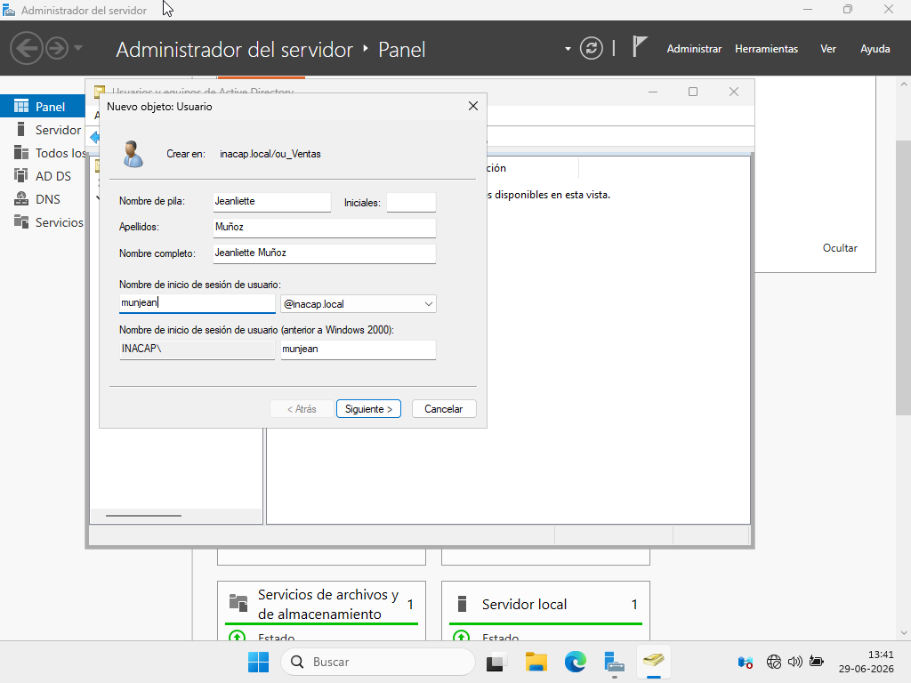

Políticas de contraseña: Desmarcar la casilla que obliga al usuario a cambiar la contraseña en su primer inicio de sesión.
 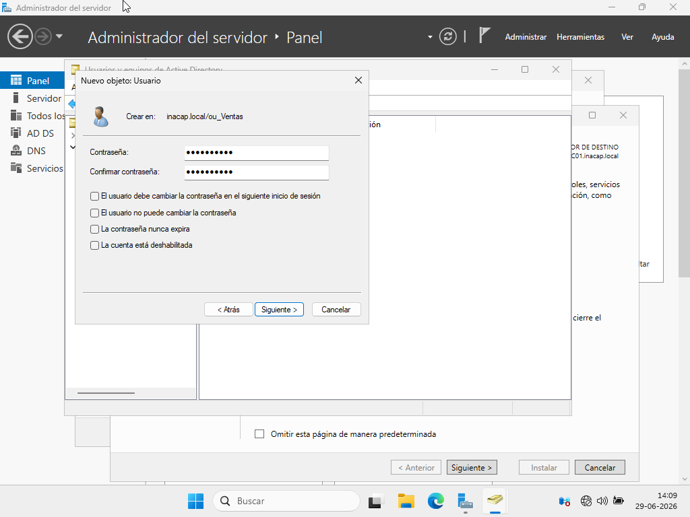

Creación de grupo: Crear un grupo denominado "G-Ventas" dentro de la misma OU.
 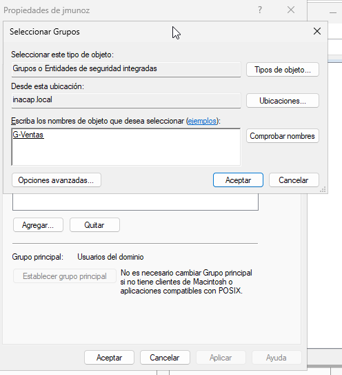

Se incorpora manualmente a los dos usuarios creados como miembros del grupo G-Ventas.
 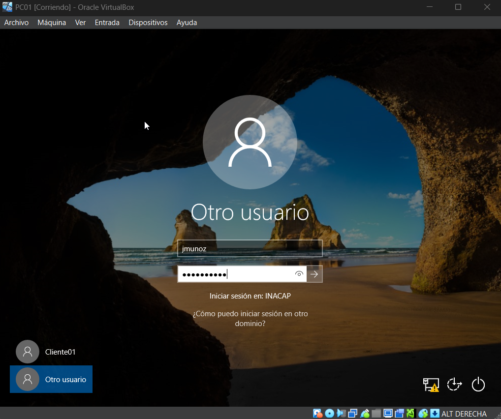

